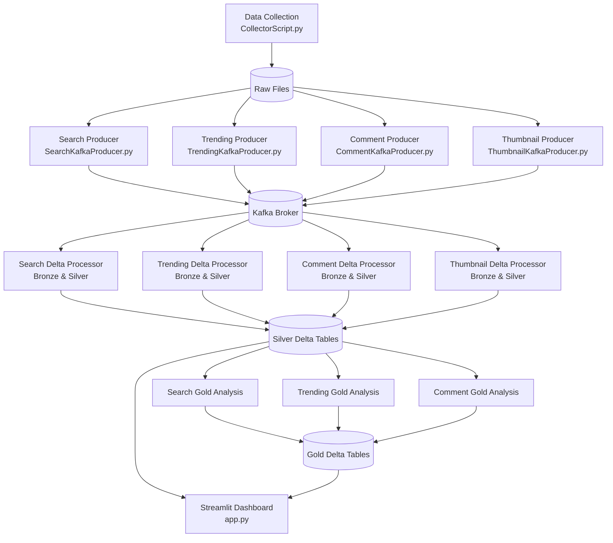

# FLOW CHART


### 1. Data Collection (`src/DataCollection`)
The pipeline starts by collecting data from YouTube (comments, search results, trending videos, and thumbnails). `CollectorScript.py` fetches the raw data and saves it to a `data/raw/` directory.

### 2. Stream Processing & Delta Lake (Docker + Kafka + Spark)
All data types follow a **Medallion Architecture** using Spark and Delta Lake, orchestrated through Kafka.
* **Producers**: Specialized producers (`SearchKafkaProducer.py`, `TrendingKafkaProducer.py`, `CommentKafkaProducer.py`, `ThumbnailKafkaProducer.py`) push raw records from disk into dedicated Kafka topics.
* **Bronze Layer**: PySpark processors subscribe to these topics and write raw, immutable records to Delta tables in `data/raw/bronze/`.
* **Silver Layer**: The processors then clean the data, handle schema enforcement, remove duplicates, and enrich the data (e.g., Sentiment Analysis, Language Detection, Image Analytics) before writing to `data/processed/silver/`.
* **Trending PySpark Processor (`TrendingDataProcessorDelta.py`)**: Subscribes to the trending Kafka stream and writes **Bronze Delta Tables** to `data/raw/bronze/trending` and **Silver Delta Tables** to `data/processed/silver/trending`.
* **Comment PySpark Processor (`CommentProcessorDelta.py`)**: Subscribes to the comment Kafka stream, performs sentiment/language enrichment, and writes **Bronze/Silver Delta Tables**.
* **Gold Analytics**: Aggregated tables are generated under `data/analysis/gold/` for:
    * **Search Analysis**: View/Engagement trends.
    * **Trending Analysis**: Growth and category patterns.
    * **Comment Analysis**: Sentiment-to-View impact, language summaries, and negative sentiment moderation alerts.

### 3. Running the Pipeline
You can run the entire end-to-end pipeline (Collection -> Kafka -> Delta -> Dashboard) using the main entry point:

```bash
python3 -m src.entry
```

Or run individual Docker-based steps:
```bash
docker compose up -d --build
docker compose exec producer python3 -m src.DataCollection.SearchKafkaProducer
docker compose exec producer python3 -m src.DataCollection.CommentKafkaProducer
docker compose exec spark-processor python3 -m src.DataProcessing.CommentProcessorDelta
docker compose exec spark-processor python3 -m src.DataAnalysis.commentAnalysis.comment_analysis_delta
```

### 4. Interactive Dashboard (`src/Dashboard/app.py`)
The Streamlit application loads the **Silver and Gold Delta Tables** from disk using the high-performance `deltalake` library. It provides a multi-page interactive web UI with readable video titles and language names to visualize audience sentiment distribution, highest correlating engagement variables, and moderation alerts.
