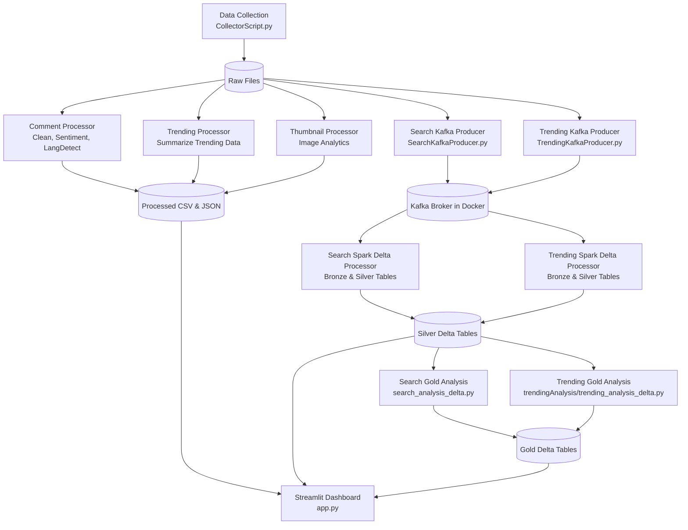

# FLOW CHART

### 1. Data Collection (`src/DataCollection`)
The pipeline starts by collecting data from YouTube (comments, search results, trending videos, and thumbnails). `CollectorScript.py` fetches the raw data and saves it to a `data/raw/` directory.

### 2. Batch Processing (`src/DataProcessing`)
Once data is collected, several specialized, offline Python scripts run over the raw data to clean it and build analytical features:
* **`CommentProcessor.py`**: Scrubs out URLs/special characters, runs Sentiment Analysis using `TextBlob`, detects comment languages using `langdetect`, and generates engagement metrics. 
* **`trending_processing.py` & `Thumbnail_processing.py`**: Similarly aggregate processing metrics for the trending and image data.
This clean output is saved as CSV and JSON files in `data/processed/`.

### 3. Stream Processing & Delta Lake (Docker + Kafka + Spark)
For search and trending records, the pipeline simulates a real-time data streaming architecture. You have a `docker-compose.yml` file standing up Zookeeper and a Kafka message broker.
* **Search Producer (`SearchKafkaProducer.py`)**: Pushes extracted raw search records into Kafka topic `youtube.search.raw`.
* **Trending Producer (`TrendingKafkaProducer.py`)**: Pushes extracted raw trending records into Kafka topic `youtube.trending.raw`.
* **Search PySpark Processor (`SearchDataProcessorDelta.py`)**: Subscribes to the search Kafka stream and processes the data using a "Medallion Architecture". It writes **Bronze Delta Tables** to `data/raw/bronze/search` and **Silver Delta Tables** to `data/processed/silver/search`.
* **Trending PySpark Processor (`TrendingDataProcessorDelta.py`)**: Subscribes to the trending Kafka stream and writes **Bronze Delta Tables** to `data/raw/bronze/trending` and **Silver Delta Tables** to `data/processed/silver/trending`.
* **Search Gold Analytics (`search_analysis_delta.py`)**: Once Search Silver data is ready, Spark generates aggregated **Gold Delta Tables** under `data/analysis/gold/search_analysis`.
* **Trending Gold Analytics (`trendingAnalysis/trending_analysis_delta.py`)**: Once Trending Silver data is ready, Spark generates aggregated **Gold Delta Tables** under `data/analysis/gold/trending_analysis`.

Docker run order for only the Kafka/Delta part:
```bash
docker compose up -d --build
docker compose exec producer python src/DataCollection/SearchKafkaProducer.py
docker compose exec producer python src/DataCollection/TrendingKafkaProducer.py
docker compose exec spark-processor python src/DataProcessing/SearchDataProcessorDelta.py
docker compose exec spark-processor python src/DataProcessing/TrendingDataProcessorDelta.py
docker compose exec spark-processor python src/DataAnalysis/searchAnalysis/search_analysis_delta.py
docker compose exec spark-processor python src/DataAnalysis/trendingAnalysis/trending_analysis_delta.py
```

### 4. Interactive Dashboard (`src/Dashboard/app.py`)
Finally, all this processed structure is brought together. A Streamlit application loads the processed CSVs, JSON, and Delta Lake Tables from disk. It creates a multi-page interactive web UI relying on `plotly` to visualize metrics like audience sentiment distribution, highest correlating engagement variables, and predictive model benchmarks. 

Everything is wired to run sequentially via the main entry point pipeline script at `src/entry/__main__.py`, which executes all processing scripts from top-to-bottom and finally opens the actual dashboard view. 
